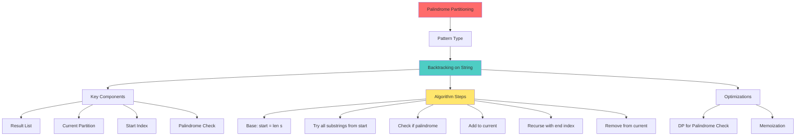

# Mind Map: Palindrome Partitioning



## Palindrome Check Methods

**1. Simple Reverse:**
```python
s == s[::-1]
```

**2. Two Pointers:**
```python
left, right = 0, len(s)-1
while left < right:
    if s[left] != s[right]:
        return False
    left += 1
    right -= 1
return True
```

**3. DP Precomputation (Best for multiple checks):**
```python
# Build palindrome table once
dp[i][j] = (s[i] == s[j]) and dp[i+1][j-1]
```
