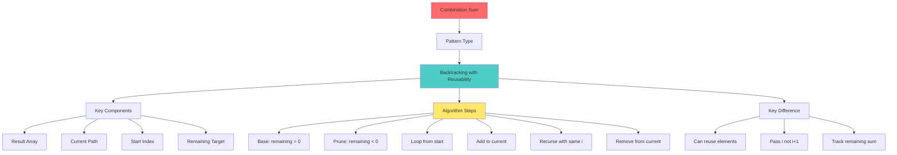

# Mind Map: Combination Sum Problem

## Problem Solving Framework

**1. Understand**
- Find combinations that sum to target
- Can reuse same element multiple times
- No duplicate combinations

**2. Pattern Recognition**
- Backtracking with sum constraint
- Similar to subsets but with reusability
- Need pruning for efficiency

**3. Key Differences from Similar Problems**
- **vs Subsets:** Has target sum constraint
- **vs Combinations:** Can reuse elements
- **vs Combination Sum II:** This allows reuse
