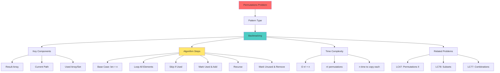

# Mind Map: Permutations Problem



## Problem Solving Framework

**1. Understand**
- Generate all arrangements of elements
- Use each element exactly once
- Order matters (different from subsets)

**2. Pattern Recognition**
- Backtracking with state tracking
- Need to track used elements
- Complete path = full permutation

**3. Implementation Steps**
```
1. Initialize result, current, and used tracking
2. Define backtrack function
3. Base case: when current length equals input length
4. For each element:
   - Skip if already used
   - Mark as used and add to current
   - Recurse
   - Mark as unused and remove from current
```

**4. Optimization**
- Use set for used elements for O(1) lookup
- Alternative: swap elements in-place
