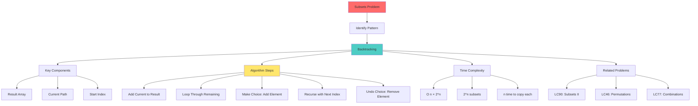

# Mind Map: Subsets Problem



## Problem Solving Framework

**1. Understand**
- Generate all possible subsets
- No duplicates allowed
- Order doesn't matter

**2. Pattern Recognition**
- Backtracking problem
- Decision tree: include or exclude
- Power set generation

**3. Implementation Steps**
```
1. Initialize result and current arrays
2. Define backtrack function
3. Base case: add current to result
4. For each remaining element:
   - Include it
   - Recurse
   - Exclude it (backtrack)
```

**4. Optimization**
- Can't optimize beyond O(2^n) - must generate all subsets
- Use iterative bit manipulation for alternative approach
