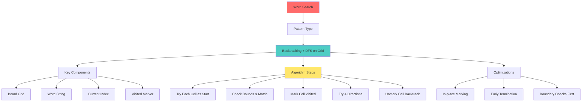

# Mind Map: Word Search Problem



## 4 Direction Exploration
```
     (row-1, col)
          ↑
(row, col-1) ← (row, col) → (row, col+1)
          ↓
     (row+1, col)
```

## State Management
- **Mark visited:** `board[row][col] = '#'`
- **Restore:** `board[row][col] = temp`
- **Purpose:** Prevent using same cell twice
