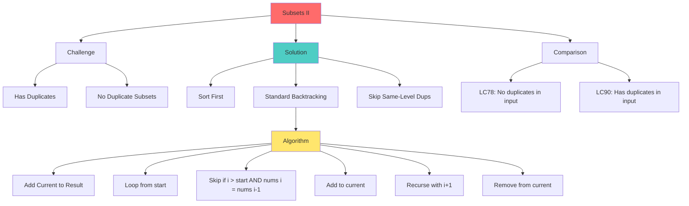

# Mind Map: Subsets II Problem



## Duplicate Handling Example
```
nums = [1, 2, 2]

Level 0: []
Level 1: [1], [2]  (skip second 2 at same level)
Level 2: [1,2], [2,2]  (both 2s from different levels)
Level 3: [1,2,2]
```
