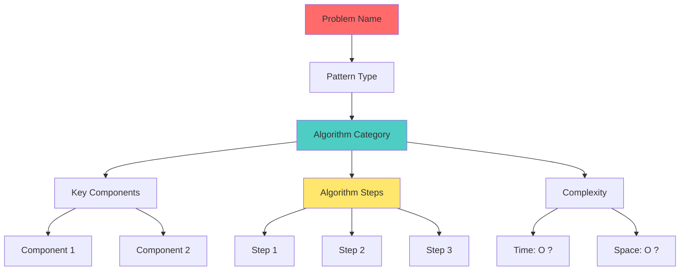

# Mind Map: [Problem Name]



## Problem Solving Framework

**1. Understand**
- [What the problem asks]
- [Key constraints]
- [Edge cases]

**2. Pattern Recognition**
- [Pattern type]
- [Similar problems]

**3. Implementation Steps**
```
1. [Step 1]
2. [Step 2]
3. [Step 3]
```

**4. Optimization**
- [Optimization opportunities]
